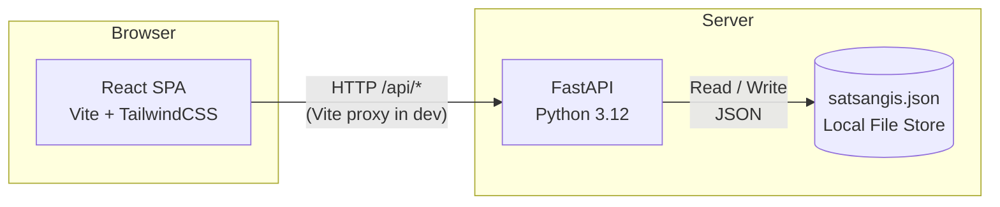
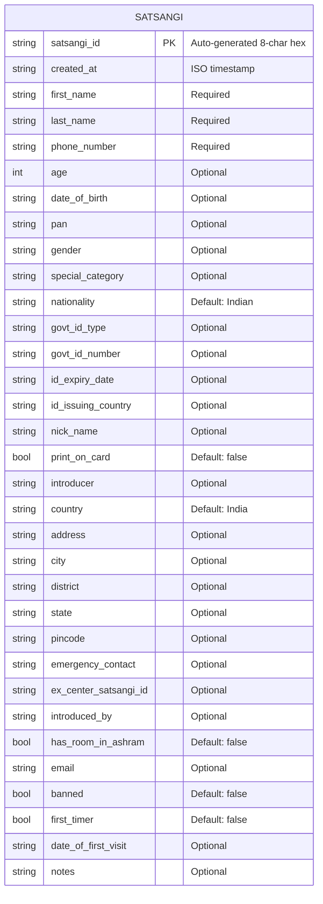
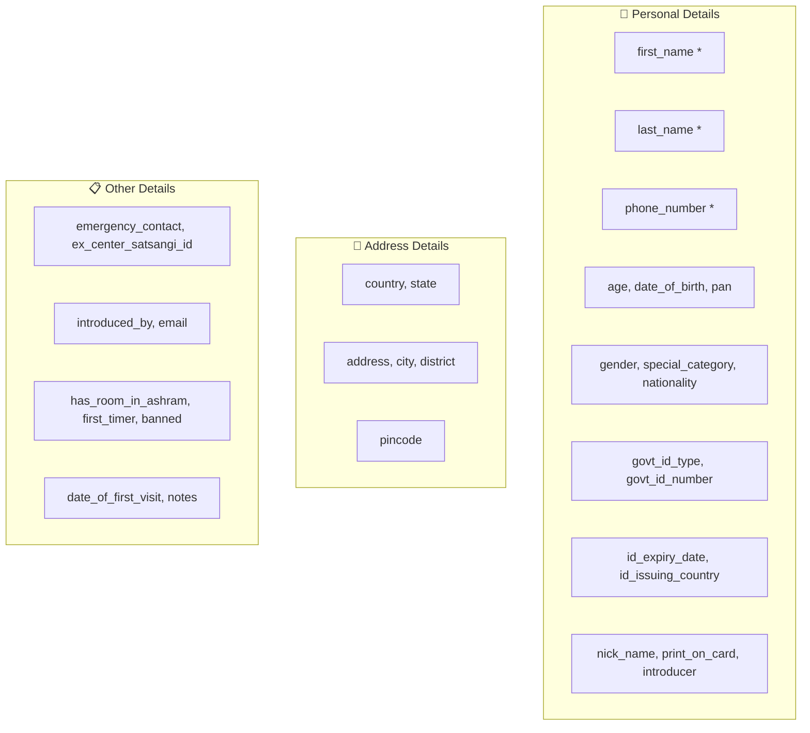
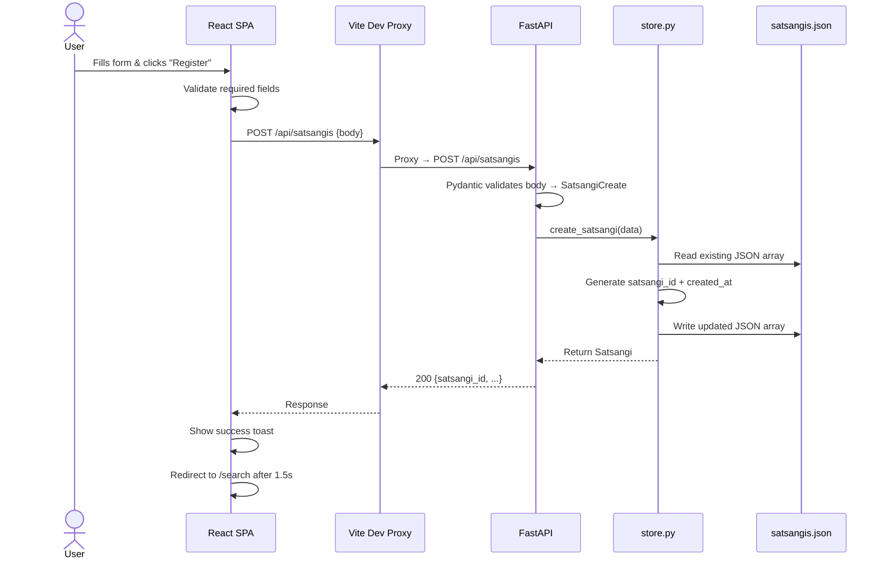
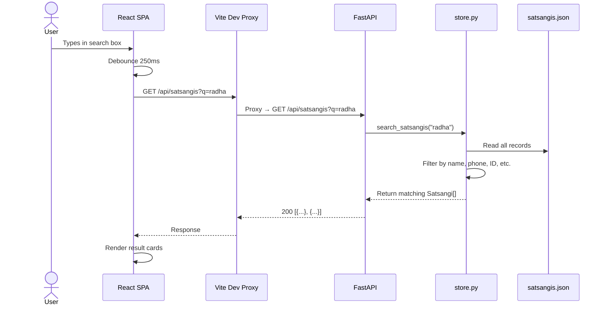
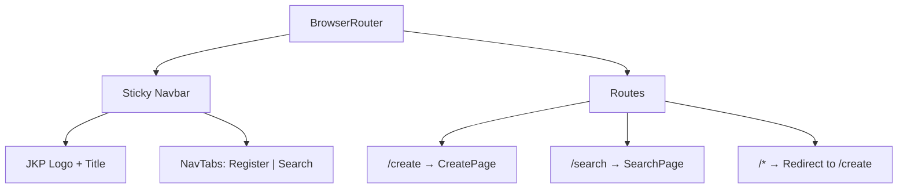
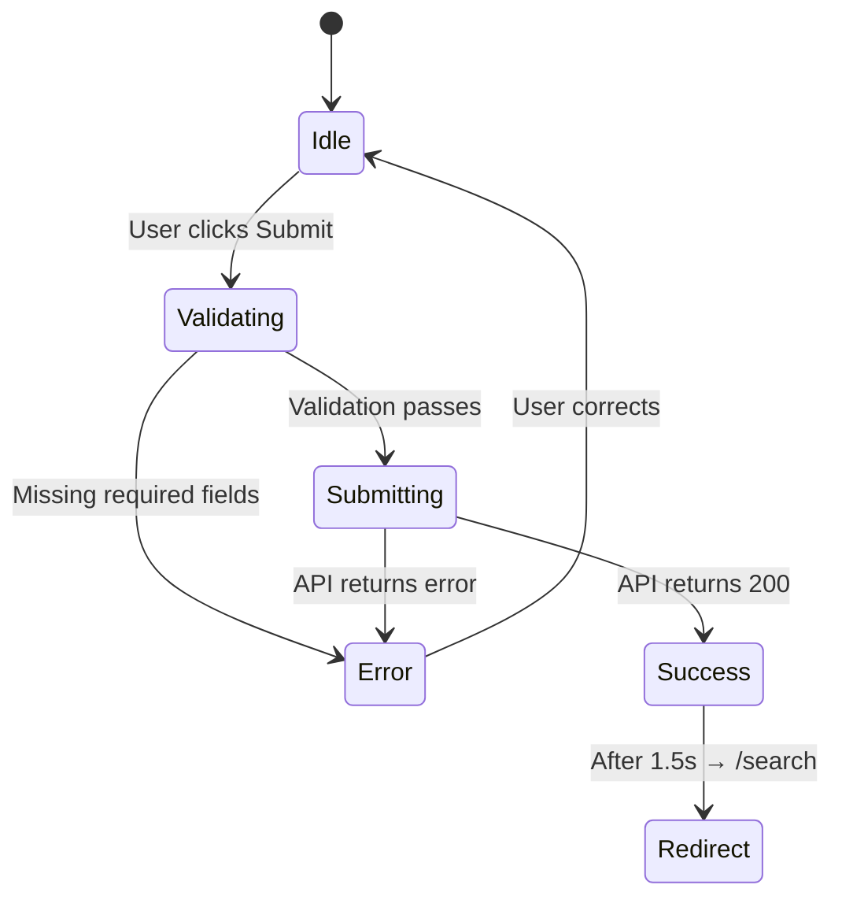
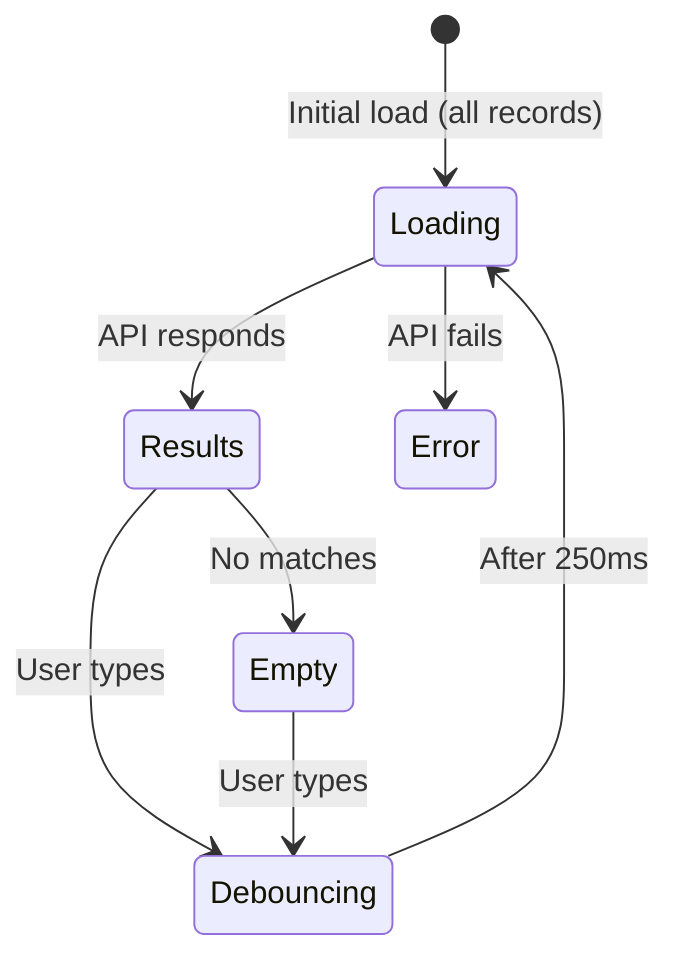
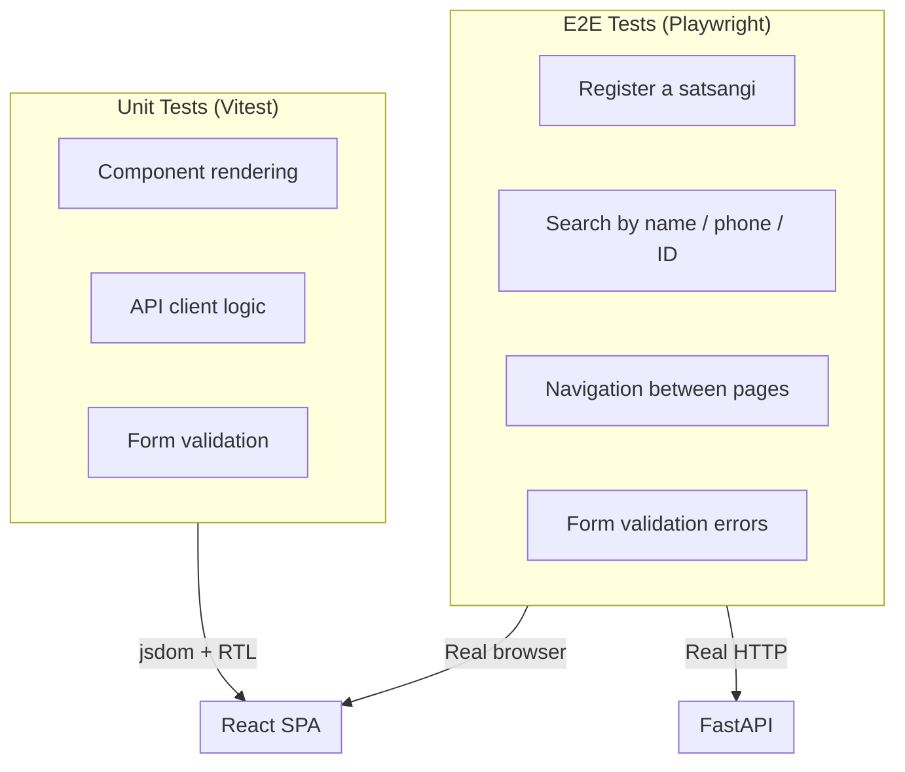

# JKP Satsangi Registration System — Documentation

> **Proof-of-Concept** for a satsangi registration and search system used at JKP ashrams.

---

## Table of Contents

1. [High-Level Architecture](#1-high-level-architecture)
2. [Tech Stack](#2-tech-stack)
3. [Project Structure](#3-project-structure)
4. [Data Model](#4-data-model)
5. [API Reference](#5-api-reference)
6. [Request / Response Flow](#6-request--response-flow)
7. [Type Safety Pipeline](#7-type-safety-pipeline)
8. [Frontend Pages](#8-frontend-pages)
9. [Testing](#9-testing)
10. [Running Locally](#10-running-locally)

---

## 1. High-Level Architecture



The system is a **two-tier** application:

- **Client** — A single-page React app served by Vite, styled with TailwindCSS 4.
- **Server** — A FastAPI backend that exposes a REST API and persists data to a local JSON file.

In development, Vite proxies all `/api/*` requests to the FastAPI server on port 8000, so the browser only talks to one origin.

---

## 2. Tech Stack

### Frontend (`client/`)

| Technology | Version | Role |
|---|---|---|
| React | 19 | UI framework |
| TypeScript | 5.9 | Type safety |
| Vite | 8 (beta) | Dev server + bundler |
| TailwindCSS | 4 | Utility-first styling |
| React Router | 7 | Client-side routing |
| Lucide React | latest | Icon library |
| openapi-typescript | 7 | Auto-generate TS types from OpenAPI |

### Backend (`server/`)

| Technology | Version | Role |
|---|---|---|
| Python | 3.12 | Runtime |
| FastAPI | 0.135 | Web framework + auto OpenAPI docs |
| Pydantic | 2.12 | Data validation & serialization |
| Uvicorn | 0.41 | ASGI server |
| Ruff | 0.15 | Linter + formatter |
| Pyright | — | Static type checker (strict mode) |
| uv | — | Python package manager |

### Testing (`tests/`)

| Technology | Role |
|---|---|
| Vitest | Unit tests (with jsdom + React Testing Library) |
| Playwright | End-to-end browser tests |
| Bun | Test runner |

---

## 3. Project Structure

```
jkpRegsitrationPOC/
├── client/                     # React frontend
│   ├── src/
│   │   ├── generated/
│   │   │   └── api.ts          # ← Auto-generated from OpenAPI
│   │   ├── pages/
│   │   │   ├── CreatePage.tsx   # Registration form
│   │   │   └── SearchPage.tsx   # Search & result cards
│   │   ├── api.ts              # API client (uses generated types)
│   │   ├── App.tsx             # Router + layout shell
│   │   ├── main.tsx            # React entry point
│   │   └── index.css           # Tailwind imports
│   ├── vite.config.ts          # Vite config + /api proxy
│   ├── package.json
│   └── tsconfig.json
│
├── server/                     # FastAPI backend
│   ├── app/
│   │   ├── main.py             # FastAPI app, routes, CORS
│   │   ├── models.py           # Pydantic models (SatsangiCreate, Satsangi)
│   │   └── store.py            # JSON file CRUD operations
│   ├── data/
│   │   └── satsangis.json      # Persisted data (auto-created)
│   └── pyproject.toml          # Python deps, ruff, pyright config
│
├── tests/                      # All tests
│   ├── unit/                   # Vitest unit tests
│   ├── e2e/                    # Playwright e2e tests
│   └── package.json
│
└── docs/                       # ← You are here
    └── README.md
```

---

## 4. Data Model

### Entity: Satsangi



### Field Groups

The form and model are organized into three logical sections:



**Required fields**: `first_name`, `last_name`, `phone_number`
**Auto-generated fields**: `satsangi_id` (8-char uppercase hex), `created_at` (ISO timestamp)

---

## 5. API Reference

Base URL: `http://localhost:8000`
Interactive docs: `http://localhost:8000/docs` (Swagger UI)

### `POST /api/satsangis` — Create Satsangi

**Request Body** (`application/json`):

```json
{
  "first_name": "Radha",
  "last_name": "Kumari",
  "phone_number": "+91 98765 43210",
  "age": 28,
  "gender": "Female",
  "nationality": "Indian",
  "city": "Vrindavan",
  "state": "Uttar Pradesh"
}
```

**Response** (`200 OK`):

```json
{
  "first_name": "Radha",
  "last_name": "Kumari",
  "phone_number": "+91 98765 43210",
  "age": 28,
  "gender": "Female",
  "nationality": "Indian",
  "city": "Vrindavan",
  "state": "Uttar Pradesh",
  "satsangi_id": "A3F7B2C1",
  "created_at": "2026-03-11T21:00:00.000000",
  "...other fields with defaults..."
}
```

**Errors** (`422`): Pydantic validation error with field-level details.

---

### `GET /api/satsangis?q=<query>` — Search Satsangis

| Parameter | Type | Default | Description |
|---|---|---|---|
| `q` | string | `""` | Search query (case-insensitive) |

**Search matches against**: first_name, last_name, full name, phone_number, satsangi_id, email, PAN, govt_id_number, nick_name, ex_center_satsangi_id, city, pincode.

If `q` is empty, returns **all** satsangis.

**Response** (`200 OK`):

```json
[
  { "satsangi_id": "A3F7B2C1", "first_name": "Radha", "..." : "..." },
  { "satsangi_id": "D9E1F4A8", "first_name": "Krishna", "..." : "..." }
]
```

---

## 6. Request / Response Flow

### Registration Flow



### Search Flow



---

## 7. Type Safety Pipeline

This project enforces **end-to-end type safety** from Python to TypeScript.

```mermaid
flowchart LR
    A["<b>Pydantic Models</b><br/>server/app/models.py<br/><i>Python source of truth</i>"] -->|"FastAPI auto-generates"| B["<b>OpenAPI Spec</b><br/>/openapi.json<br/><i>Machine-readable schema</i>"]
    B -->|"openapi-typescript<br/><code>bun run generate:api</code>"| C["<b>Generated Types</b><br/>client/src/generated/api.ts<br/><i>Auto-generated TS interfaces</i>"]
    C -->|"re-exported by"| D["<b>API Client</b><br/>client/src/api.ts<br/><i>Typed fetch wrappers</i>"]
    D -->|"used by"| E["<b>React Pages</b><br/>CreatePage / SearchPage<br/><i>Type-checked at compile time</i>"]

    style A fill:#3b82f6,color:#fff
    style B fill:#f59e0b,color:#fff
    style C fill:#10b981,color:#fff
    style D fill:#8b5cf6,color:#fff
    style E fill:#ec4899,color:#fff
```



### How it works

1. **Pydantic models** (`models.py`) define the schema with full Python type hints, validated at runtime.
2. **FastAPI** reads those models and auto-generates an **OpenAPI 3.1 JSON spec** at `/openapi.json`.
3. **openapi-typescript** reads that spec and generates TypeScript interfaces in `client/src/generated/api.ts`.
4. **`api.ts`** re-exports those generated types as `SatsangiCreate` and `Satsangi` and uses them in fetch wrappers.
5. **React pages** import those types — TypeScript catches any mismatch at compile time.

### Regenerating types

When you change a Pydantic model on the server:

```bash
# 1. Server must be running
cd server && uv run uvicorn app.main:app --port 8000

# 2. Regenerate client types
cd client && bun run generate:api
```

### Static analysis tools

| Layer | Tool | Mode |
|---|---|---|
| Python | **Pyright** | `strict` — catches all untyped code |
| Python | **Ruff** | Lints for errors, imports, modern syntax |
| TypeScript | **tsc** | Strict mode via tsconfig |

---

## 8. Frontend Pages

### App Shell (`App.tsx`)



### CreatePage — Registration Form

A three-section form with client-side validation.



**Form sections**:
- **Personal Details** — Name, phone, age, DOB, PAN, gender, nationality, government ID, introducer
- **Address Details** — Country, state, address, city, district, pincode
- **Other Details** — Emergency contact, introduced by, email, room in ashram, first timer, banned, notes

**UI components** (defined locally in the file):
- `Section` — Fieldset with styled legend
- `Row` — 2-column responsive grid
- `Input` — Text/number/date/tel input with label
- `Select` — Dropdown with label
- `Checkbox` — Styled checkbox with label
- `Spinner` — SVG loading animation

### SearchPage — Search & Results



**Features**:
- **Debounced search** — 250ms delay to avoid spamming the API
- **Shimmer loading** — Animated placeholder cards while fetching
- **Rich result cards** — Initials avatar, name, satsangi ID badge, contact info, location, tags
- **Tags** — Government ID, nickname, introduced by, first timer (blue), has room (green), banned (red)

---

## 9. Testing

### Unit Tests (Vitest)

```bash
cd tests && bun run test:unit
```

- 21 tests covering component rendering and API logic
- Uses **jsdom** + **React Testing Library**
- Config: `tests/vitest.config.ts`

### E2E Tests (Playwright)

```bash
cd tests && bun run test:e2e
```

- 9 tests covering full user flows
- Runs in **Chromium** (headless)
- Tests registration, search, navigation, validation

### Test Architecture



---

## 10. Running Locally

### Prerequisites

- **Python 3.12+** and **uv** (Python package manager)
- **Bun** (JavaScript runtime & package manager)

### Start the server

```bash
cd server
uv run uvicorn app.main:app --port 8000
```

Server runs at `http://localhost:8000`. Interactive API docs at `http://localhost:8000/docs`.

### Start the client

```bash
cd client
bun install
bun run dev
```

Client runs at `http://localhost:5174` (or next available port). All `/api/*` requests are proxied to port 8000.

### Regenerate API types

```bash
# Server must be running first
cd client
bun run generate:api
```

### Run tests

```bash
cd tests
bun install
bun run test:unit    # 21 unit tests
bun run test:e2e     # 9 e2e tests (needs server + client running)
```

---

## Appendix: OpenAPI Spec

The full OpenAPI 3.1 spec is auto-generated by FastAPI and available at:

- **Swagger UI**: [http://localhost:8000/docs](http://localhost:8000/docs)
- **ReDoc**: [http://localhost:8000/redoc](http://localhost:8000/redoc)
- **Raw JSON**: [http://localhost:8000/openapi.json](http://localhost:8000/openapi.json)

These docs are always in sync with the Pydantic models — change `models.py` and the spec updates automatically on server restart.
